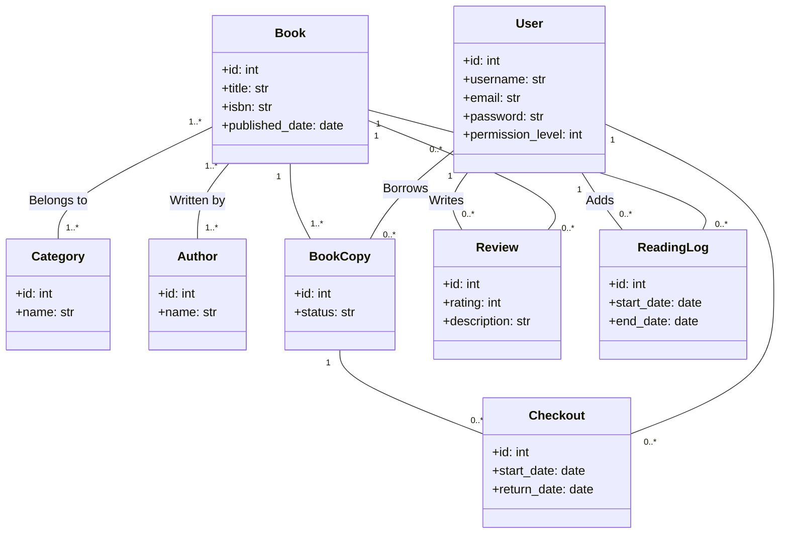

## System overview

*One paragraph: what does the system do and how do the main parts connect?*

Library App är en server side rendering app. Den har ett internt API som kommunicerar med databasen. JSON datan från API:et används för att rendera HTML sidor.

## Diagram

*Add a diagram showing your components (frontend, backend, database, external APIs).
Use [Excalidraw](https://excalidraw.com), [draw.io](https://draw.io), or any tool - paste a screenshot or link here.*

{width=420 height=199}
{width=641 height=600}

**ER in Mermaid:**

## Components

| Component | Responsibility | Technology |
|---|---|---|
| Library API | | Python, Flask |
| Database | | PostgreSQL |
| Server | Deployment | Docker, Nginx, Cloudflare |

## Key decisions

*Why did you pick the tech you picked? One line per decision is enough.*

- **Why Flask:** Jag har använt det förut och jag tycker det är lätt att använda.
- **Why PostgreSQL:** Jag tyckte att en relationsbaserad databas skulle passa bra.
- **Why Docker:** Det är lätt att starta APIet på servern med docker compose.
- **Why Cloudflare:** Servern är på mitt hemnätverk. Trafiken går igenom Cloudflare tunneln innan det går till servern.
